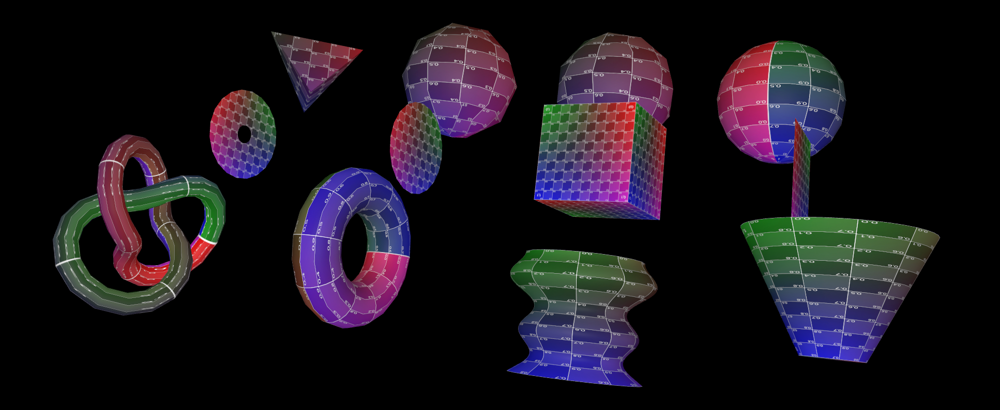
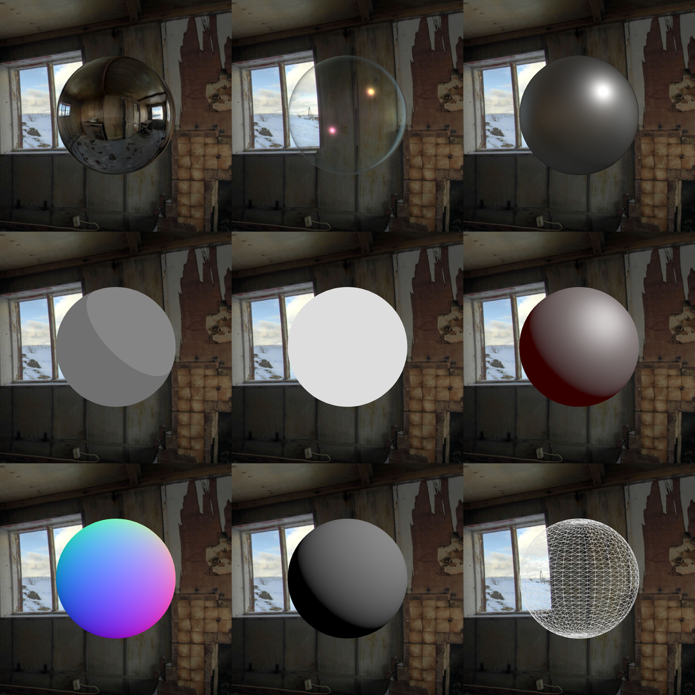
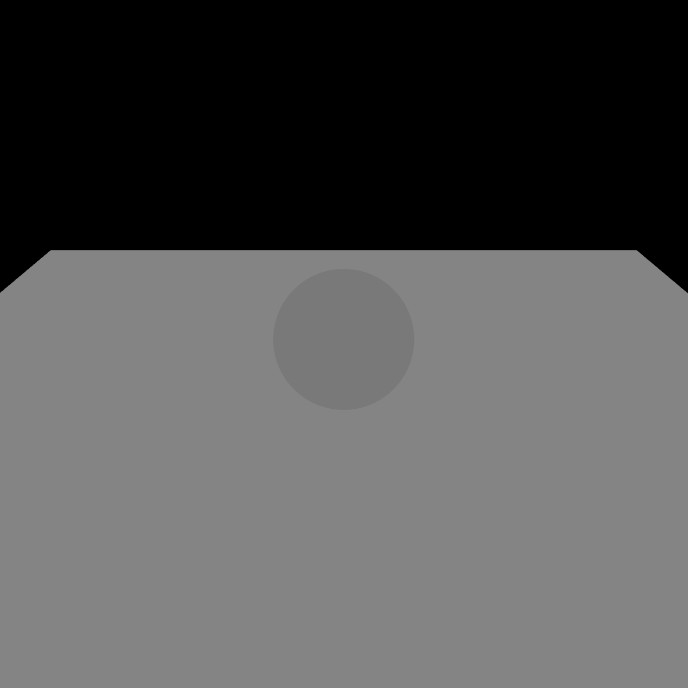
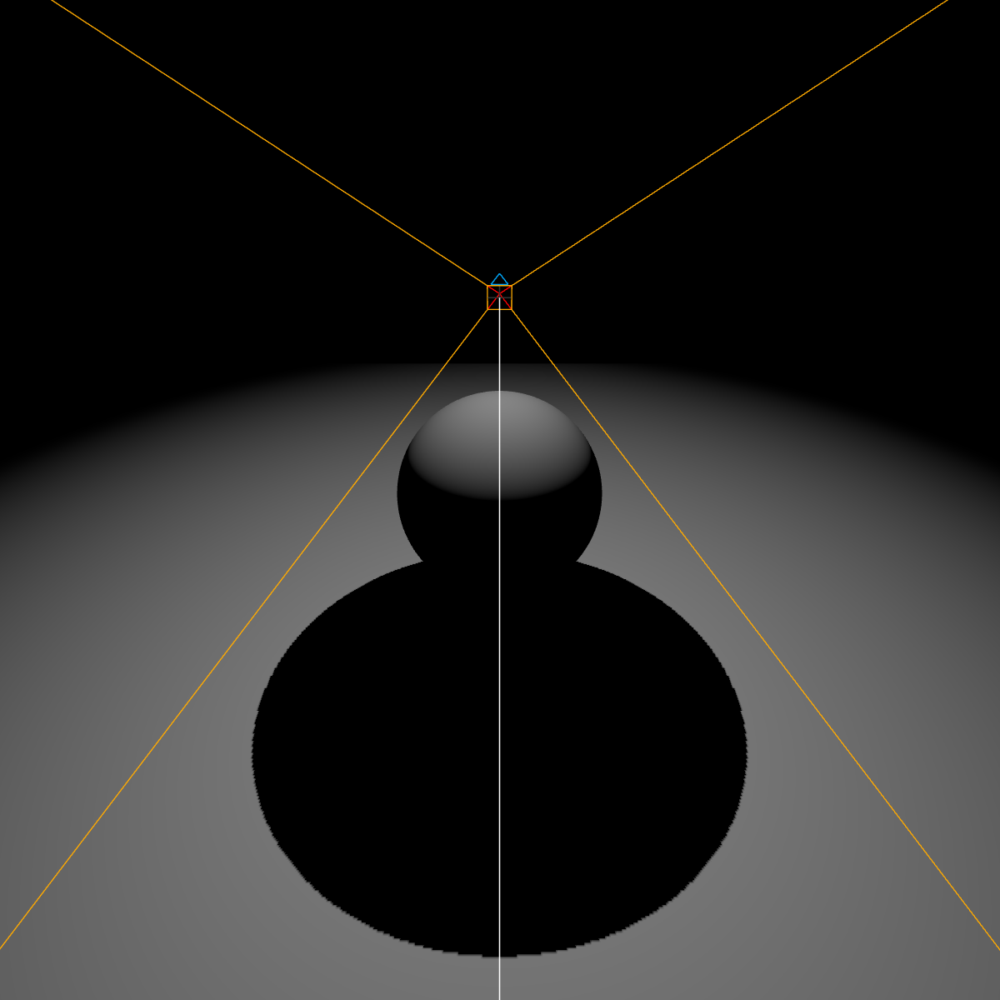
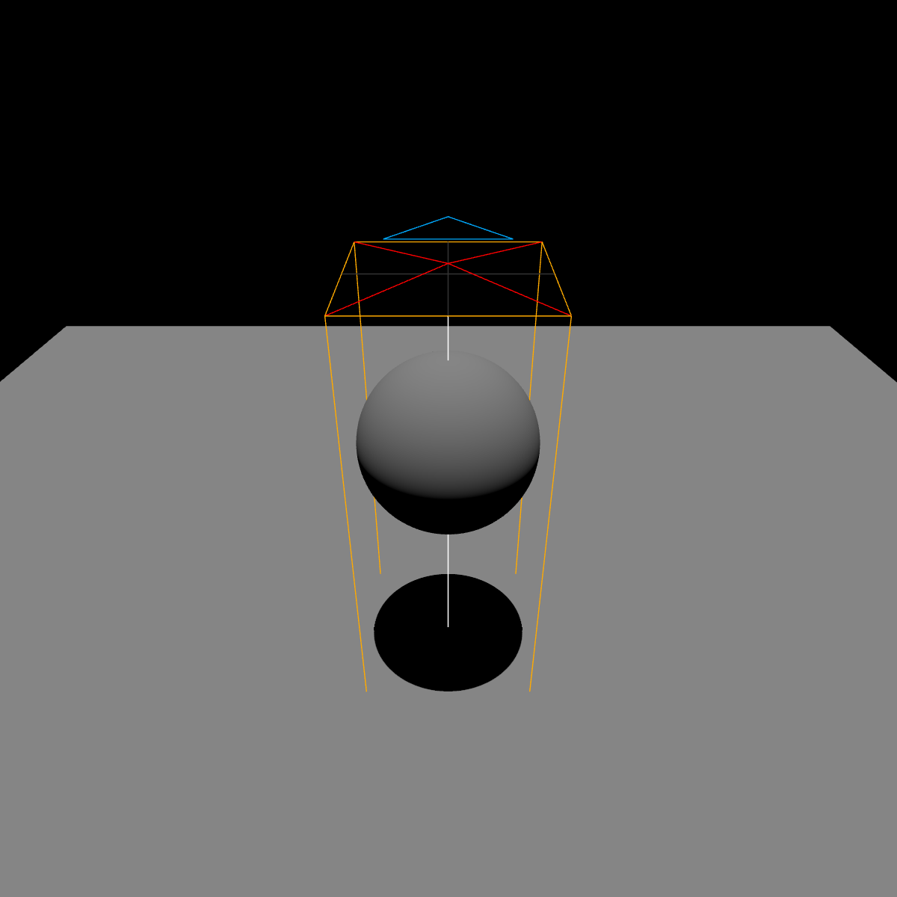
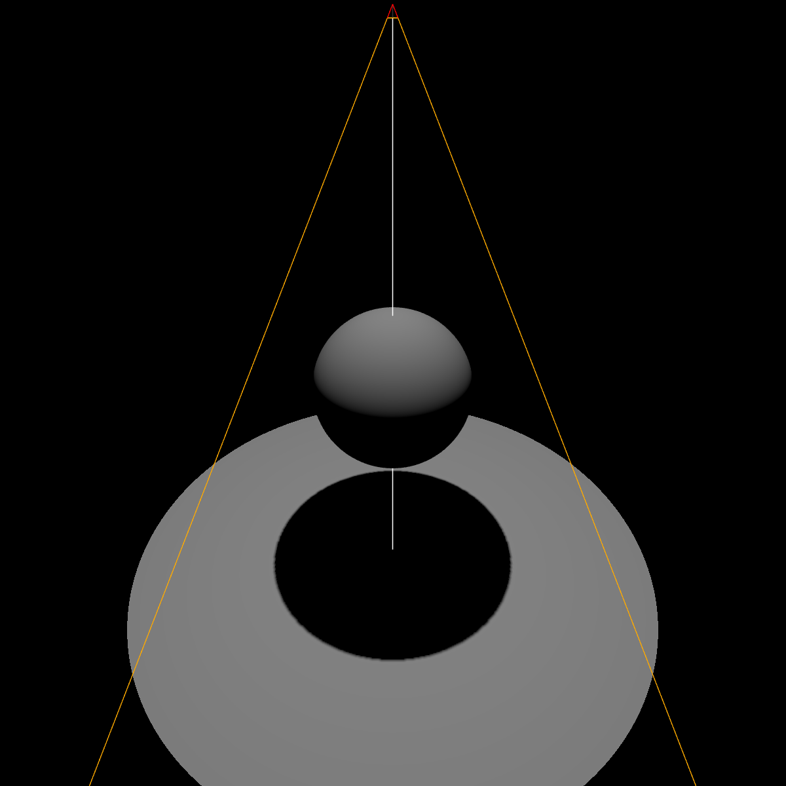

# Geometries, materials and lights

In Three.js, objects are composed of two parts: a geometry and a material. The **geometry defines the shape** of the object, and the **material defines its appearance**.

## Geometry

The geometry is the shape of the object. It can be a simple shape like a cube or a sphere, or a more complex shape like a human body. Three.js provides a lot of [built-in geometries](https://threejs.org/examples/#webgl_geometries) that you can use, but you can also create your own geometries.

Here is an example of a sphere geometry:

```js
const geometry = new THREE.SphereGeometry( 5, 32, 32 );
```

The geometries are not continuous shapes, they are made of a lot of triangles. The more triangles there are, the smoother the shape will be. Here, the first parameter of the geometry constructor is the radius of the sphere, the second is the number of horizontal segments, and the third is the number of vertical segments. The more segments there are, the smoother the sphere will be.



## Material

The material defines the appearance of the object. It can be a simple color, or a more complex material like a texture or a material that reacts to light. Three.js provides a lot of [built-in materials](https://threejs.org/examples/#webgl_materials) that you can use, but you can also create your own materials using [shaders](https://threejs.org/docs/#api/en/materials/ShaderMaterial).


Here is an example of a basic material:

```js
const material = new THREE.MeshBasicMaterial( { color: 0x00ff00 } );
```

This will create a material with a green color. The color is defined using hexadecimal values.



###

## Mesh

The mesh is the combination of a geometry and a material. It is the object that will be added to the scene. You can create a mesh using the following code:

```js
const mesh = new THREE.Mesh(geometry, material);
scene.add(mesh);
```

## Groups

Multiple objects can be grouped together using the `Group` class. This allows you to move, rotate or scale multiple objects at the same time. You can create a group using the following code:

```js
const group = new THREE.Group();
group.add(mesh1);
group.add(mesh2);
scene.add(group);
```

## Lights

Most materials react to light, so you need to add lights to your scene.

### Ambient light



```js
const light = new THREE.AmbientLight( 0xffffff );
scene.add( light );
```

### Point light



```js
const light = new THREE.PointLight( 0xffffff, 1, 0, 0.01 );
light.position.set( 1, 1, 1 );
scene.add( light );
```

### Directional light



```js
const light = new THREE.DirectionalLight( 0xffffff, 1 );
// Set the position of the light
light.position.set( 1, 1, 1 );
// Make the light point toward an object (here, a sphere that we defined before)
light.target = sphere;
scene.add( light );
```

### Spot light



```js
const light = new THREE.SpotLight( 0xffffff, 1, 0, Math.PI / 4, 0.01 );
// Set the position of the light
light.position.set( 1, 1, 1 );
// Make the light point toward an object (here, a sphere that we defined before)
light.target = sphere;
scene.add( light );
```

## Example

```js
import * as THREE from 'three';
import { OrbitControls } from 'three/addons/controls/OrbitControls.js';

// Create a scene
const scene = new THREE.Scene();

// Create a camera
const camera = new THREE.PerspectiveCamera(75, window.innerWidth / window.innerHeight, 0.1, 1000);
camera.position.set(0, 0, 15);

// Import the canvas element
const canvas = document.getElementById('canvas');

// Create a WebGLRenderer and set its width and height
const renderer = new THREE.WebGLRenderer({
    canvas: canvas,
    // Antialiasing is used to smooth the edges of what is rendered
    antialias: true,
    // Activate the support of transparency
    alpha: true
});

renderer.setSize( window.innerWidth, window.innerHeight );
renderer.setPixelRatio( window.devicePixelRatio );

// Create the controls
const controls = new OrbitControls(camera, canvas);

// Handle the window resize event
window.addEventListener('resize', () => {
    // Update the camera
    camera.aspect =  window.innerWidth / window.innerHeight;
    camera.updateProjectionMatrix();

    // Update the renderer
    renderer.setSize(window.innerWidth, window.innerHeight);
    renderer.setPixelRatio(window.devicePixelRatio);
});


const textureLoader = new THREE.TextureLoader();

// Adding a background
let textureEquirec = textureLoader.load( 'background.jpg' );
textureEquirec.mapping = THREE.EquirectangularReflectionMapping;
textureEquirec.colorSpace = THREE.SRGBColorSpace;

scene.background = textureEquirec;

// Add a light
const light = new THREE.PointLight( 0xffffff, 1, 0, 0 );
light.position.set( 20, 20, 20 );
scene.add( light );

// Create the sphere
const geometry = new THREE.SphereGeometry( 5, 32, 32 );
const material = new THREE.MeshPhysicalMaterial( {
    clearcoat: 0.3,
    clearcoatRoughness: 0.25,
    color: 0xffffff,
    envMap: textureEquirec,
    envMapIntensity: 1.0,
    ior: 1.25,
    iridescence: 0.8,
    metalness: 0,
    roughness: 0.2,
    thickness: 5.0,
    transmission: 1.0,
} );
const mesh = new THREE.Mesh(geometry, material);
scene.add(mesh);

// Create the animation loop
const animate = () => {
    // Call animate recursively
    requestAnimationFrame(animate);

    // Update the controls
    controls.update();

    // Render the scene
    renderer.render(scene, camera);
}

// Call animate for the first time
animate();
```

Next, [debugging](<./03 - Debugging.md>).
