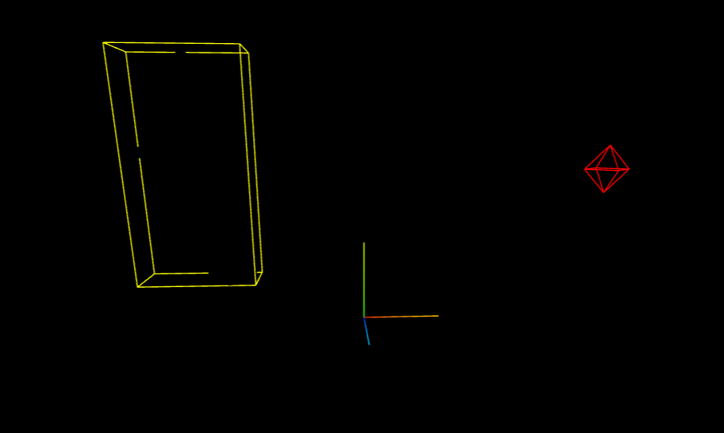
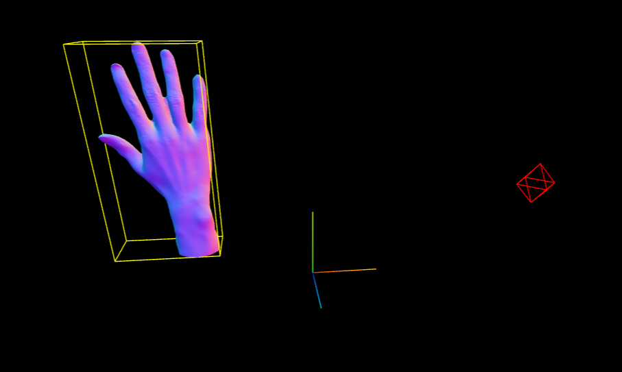

# Debugging

Finding the source of an error or of an unexpected behavior is a major part of development. Fortunately, a few tools are present to help in these tasks.

## Inside the browser: Inspector

The inspector is a built-in tool in web browsers. It allows the user to see the layout of the page, access a debug console, check the network activity, evaluate the performances and the memory usages

### Elements

The elements section allows you to checkout how the html page is organized and what style is applied to each of the elements.

### Console

The console is especially useful since it allows you to interact with the javascript code running on the page. You can read, change and create global variables, objects and functions as well see the output of the console.log function.

### Network

The network section allows you to see the different http requests the website is doing, which is especially interesting in this case since it allows us to see which elements are not loading correctly, or which files slow down the loading of the page.

### Performance

In Three.Js, each frame triggers a render of the scene. The performance section allows you to see how long each frame takes to render, and what is the bottleneck of the rendering.

### Memory

The memory section allows you to see how much memory is used by the page, and what is using it. Memory leaks can be a major issue in javascript, so it is important to keep an eye on this section.

## Inside the page: lil-gui

lil-gui is a small library that allows you to create a graphical user interface to control variables in your code. It is especially useful to tweak the parameters of your scene without having to reload the page each time.

### Using lil-gui

To import the tool, use the following in `script.js`:

```js
import { GUI } from 'three/addons/libs/lil-gui.module.min.js';
```

To create a GUI, use the following code:

```js
const gui = new GUI();
```

To control the parameter of an object, you need to add it to the GUI and specify the name of the parameter. You can also specify the display name of the parameter using the `name` method.

For example, let's control a parameter called `x` of a `myObject` object:


```js
gui.add(myObject, 'x').name('Displayed name of the parameter');
```

The type of the input will depend on the type of the parameter. If the parameter is a boolean, it will create a checkbox. If the parameter is a number, it will create an input field, a slider or a dropdown depending on the parameters you provide. If the parameter is a color, it will create a color picker.

You can also create folders to organize your parameters using the `addFolder` method.

```js
const folder = gui.addFolder('Name of the folder');
folder.add(myObject, 'x');
```

### Example

```js
import * as THREE from 'three';
import { GUI } from 'three/addons/libs/lil-gui.module.min.js';

const scene = new THREE.Scene();
const camera = new THREE.PerspectiveCamera(75, window.innerWidth / window.innerHeight, 0.1, 1000);
camera.position.set(0, 0, 5);
const canvas = document.getElementById('canvas');
const renderer = new THREE.WebGLRenderer({
    canvas: canvas,
    antialias: true
});
renderer.setSize(window.innerWidth, window.innerHeight);
renderer.setPixelRatio(window.devicePixelRatio);

const sphere = new THREE.Mesh(
    new THREE.SphereGeometry(1, 32, 32),
    new THREE.MeshBasicMaterial({ color: 0xffffff, transparent: true })
);
scene.add(sphere);

/* ----------- The good stuff ----------- */

const gui = new GUI();

// The visible property of the sphere is a boolean so this will create a checkbox
gui.add(sphere, 'visible').name('visible');

// We can create a folder to organize the parameters
const positionFolder = gui.addFolder( 'Position' );
// x is a number and we defined a min and a max value so this will create a slider, with a step of 1
positionFolder.add(sphere.position, 'x', -5, 5, 1).name('X');
// No min and max value so this will create an input field
positionFolder.add(sphere.position, 'y').name('Y');
// We defined an array of values so this will create a dropdown
positionFolder.add(sphere.position, 'z', [-5, -3, 0, 3]).name('Z');

const styleFolder = gui.addFolder( 'Style' );
// We defined a min and a max value so this will create a slider, with a step of 0.01
styleFolder.add(sphere.material, 'opacity', 0, 1, 0.01).name('opacity');
// wireframe is a boolean so this will create a checkbox
styleFolder.add(sphere.material, 'wireframe').name('wireframe');
// We will create a color picker that will update the color of the sphere
styleFolder.addColor(sphere.material, 'color').name('color')

/* ------------------------------------- */

const animate = () => {
    requestAnimationFrame(animate);
    renderer.render(scene, camera);
}

animate();
```

## Inside the scene: Three.js Helpers

Three.js provides a few helpers that can be added to the scene to help with debugging. They are not meant to be used in production, but they can be very useful during development. Here are a few of them:

### AxesHelper

The AxesHelper is a helper that displays the three axes of the scene. It is useful to see the orientation of the scene.

```js
const axesHelper = new THREE.AxesHelper( 5 );
scene.add( axesHelper );
```

### PointLightHelper

The PointLightHelper is a helper that displays the position of a point light.

```js
const light = new THREE.PointLight( 0xffffff, 1, 0, 0 );
light.position.set( 20, 20, 20 );
scene.add( light );

const lightHelper = new THREE.PointLightHelper( light, 1 );
scene.add( lightHelper );
```

### BoxHelper

The BoxHelper can display the bounding box of a mesh. For example, when loading a gltf file, the mesh can be very large or very small, and be completely black. The BoxHelper allows you to see the size of the object and to see if it is correctly placed in the scene.

```js
const box = new THREE.BoxHelper( mesh, 0xffff00 );
scene.add( box );
```

### Example

```js
import * as THREE from 'three';
import { OrbitControls } from 'three/addons/controls/OrbitControls.js'
import { GLTFLoader } from 'three/addons/loaders/GLTFLoader.js';


const scene = new THREE.Scene();
const camera = new THREE.PerspectiveCamera(75, window.innerWidth / window.innerHeight, 0.1, 100000);
camera.position.set(0, 25, 25);
const canvas = document.getElementById("canvas");
const controls = new OrbitControls(camera, canvas);
const renderer = new THREE.WebGLRenderer({
    canvas: canvas,
    antialias: true
})
renderer.setSize(window.innerWidth, window.innerHeight);
renderer.setPixelRatio(window.devicePixelRatio);

/* ----------- The good stuff ----------- */

const axesHelper = new THREE.AxesHelper(5);
scene.add(axesHelper);

const pointLight = new THREE.PointLight( 0xff0000, 1, 100 );
pointLight.position.set( 10, 10, 10 );
scene.add( pointLight );

const sphereSize = 1;
const pointLightHelper = new THREE.PointLightHelper( pointLight, sphereSize );
scene.add( pointLightHelper );


let loader = new GLTFLoader();
loader.load(
    "./hand.gltf",
    (hand) => {
        let mesh = hand.scene;
        mesh.scale.set(50, 50, 50);
        mesh.traverse((node) => {
            if (node.isMesh) {
                node.material = new THREE.MeshNormalMaterial();
            }
        })
        scene.add(mesh);
        // Here, we use the BoxHelper to create a bounding box around the hand
        const box = new THREE.BoxHelper( hand.scene, 0xffff00 );
        scene.add( box );
    },
    (xhr) => {
		console.log( (xhr.loaded / xhr.total * 100) + '% loaded' );
	},
    (error) => {
        console.log(error)
    }
)

/* ------------------------------------- */

function animate() {
    requestAnimationFrame(animate);

    controls.update();

    renderer.render(scene, camera);
}

animate();

window.addEventListener("resize", () => {
    camera.aspect = window.innerWidth / window.innerHeight;
    camera.updateProjectionMatrix();

    renderer.setSize(window.innerWidth, window.innerHeight);
    renderer.setPixelRatio(window.devicePixelRatio);
})
```




Next, [loader, textures and models](<./04 - Loader, textures and models.md>)
